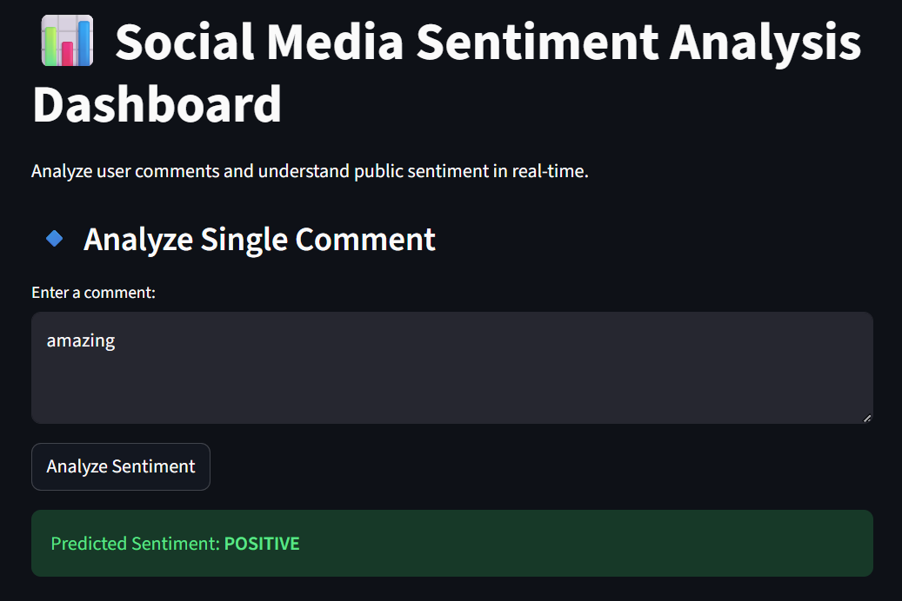

# 📊 Social Media Sentiment Analysis Dashboard

## 🔍 Overview

This project is a Machine Learning + NLP-based dashboard that analyzes social media comments and classifies them into **Positive, Negative, or Neutral sentiments**.

It simulates a real-world system used by companies to understand customer opinions and feedback.

---

## ❗ Problem Statement

With millions of user comments generated daily on platforms like Twitter, YouTube, and Instagram, it becomes impossible for companies to manually analyze public sentiment.

This project provides an automated solution to:

* Analyze user opinions
* Detect negative feedback early
* Understand customer satisfaction
* Improve decision-making

---

## 🌍 Industry Relevance

Sentiment Analysis is widely used by:

* E-commerce platforms (product reviews)
* Food delivery apps (customer feedback)
* OTT platforms (content reviews)
* Banks (complaint analysis)
* Startups (brand monitoring)

---

## 🛠️ Tech Stack

* Python
* Pandas, NumPy
* Scikit-learn
* TF-IDF Vectorizer
* Logistic Regression
* Matplotlib
* Streamlit

---

## 🏗️ Project Architecture

```
Text Data → Cleaning → Preprocessing → TF-IDF → ML Model → Prediction → Dashboard → Insights
```

---

## 📁 Folder Structure

```
├── data/
├── src/
├── app/
├── models/
├── outputs/
├── images/
├── README.md
├── requirements.txt
```

---

## ⚙️ Installation

```bash
git clone https://github.com/your-username/Social-Media-Sentiment-Analysis-Dashboard.git
cd Social-Media-Sentiment-Analysis-Dashboard
pip install -r requirements.txt
```

---

## ▶️ How to Run

### Step 1: Generate Dataset

```bash
python data/generate_synthetic_data.py
```

### Step 2: Train Model

```bash
python src/train.py
```

### Step 3: Run Dashboard

```bash
streamlit run app/app.py
```

---

## 📸 Dashboard Screenshots

### 🔹 Main Dashboard



## 📊 Sentiment Distribution
![Sentiment Distribution]

## 📊 Sentiment Count
)

---

## 📊 Results

* Successfully classified sentiments into 3 categories
* Visualized sentiment distribution using charts
* Enabled real-time comment analysis

---

## 🎯 Learning Outcomes

* Natural Language Processing (NLP)
* Text preprocessing techniques
* TF-IDF feature extraction
* Machine Learning model building
* Streamlit dashboard development
* End-to-end project deployment


